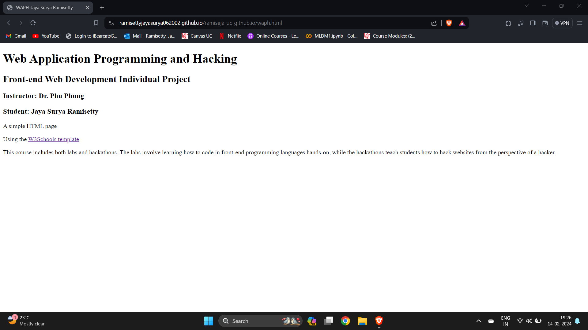
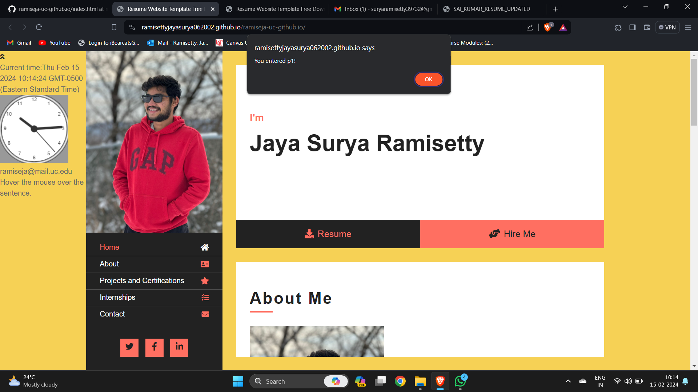
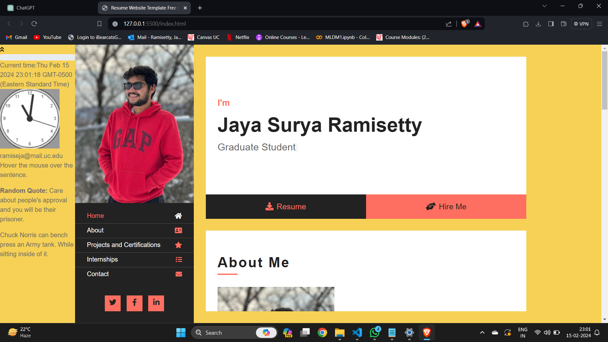
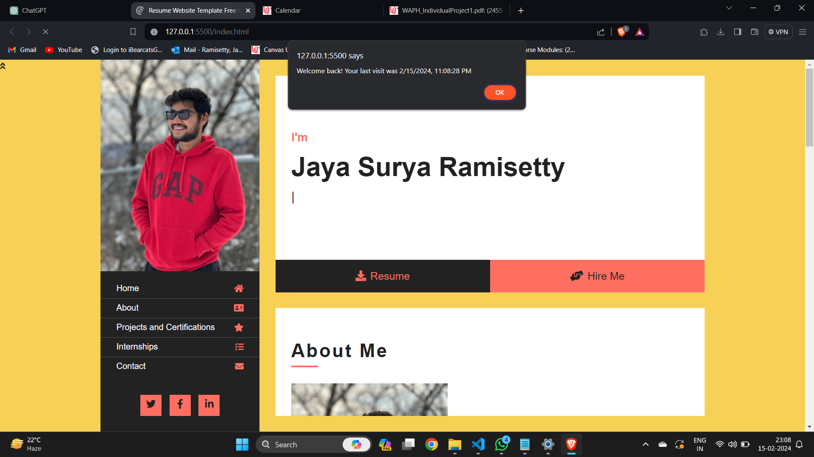

# ramiseja-uc-github.io

# WAPH-Web Application Programming and Hacking

## Instructor: Dr. Phu Phung

## Student

**Name**: Jaya Surya Ramisetty

**Email**: ramiseja@mail.uc.edu

**Short-bio**: I am Interested in web development and cooking. 

## Repository Information

Respository's URL: [https://github.com/RamisettyJayaSurya062002/waph-ramiseja.git](https://github.com/RamisettyJayaSurya062002/waph-ramiseja.git)

Link to index.html = [Link to index.html](https://github.com/RamisettyJayaSurya062002/ramiseja-uc-github.io/blob/main/index.html)

### INDIVIDUAL PROJECT 1:

Personal Website Creation :

- Made a polished profile website that is stored in my username repository on GitHub Pages. 

- Name, photo, contact details, education, experiences, background, and talents were all listed on the webpage.

- Created a responsive layout and organized the content using HTML, CSS, and the Bootstrap framework.

- Modified the website to highlight my skills and attract jobs.

Course Introduction Page (5 points): 
To introduce the "Web Application Programming and Hacking" course, a new HTML page was added and linked from the site.

- Gave a rundown of the subjects covered in the course, the laboratories, hackathons, and the practical projects. 

- Described the main ideas, tools, and abilities that the course covered.

- Created a page with content and layout that provides visitors with information about the course.

Basic Code for JavaScript (20 points)

- jQuery library was used for events and DOM manipulation.

- Added the Moment.js module to show both analog and digital clocks that are dynamic. 

- jQuery was used to provide the show/hide email functionality, which toggles email visibility.

- Created a random quote generator with the Quotable API and JavaScript.

- Added ScrollReveal.js for smooth scrolling when clicking navigation links.

- - To quickly construct the layout and components, I made use of Bootstrap's grid structure and UI elements like buttons, navbars, cards, etc.

- To style items without creating unique CSS, I made use of Bootstrap's utility classes for typography, colors, spacing, and scaling.

- I selected a Bootswatch free open-source theme and integrated it using a content delivery network (CDN) for pre-defined CSS and visual design.

- Out of the box, the theme offers uniform styling for all elements, including lists, forms, headers, and paragraphs.

WEB API INTEGRATION (20 pts)

- To display a selection of well-known quotes at random, I incorporated the Quotable API.

- To display random Chuck Norris jokes, I used the Chuck Norris Jokes API. 

- I parsed the quote JSON data returned by the Quotable API to show the quote text and author.

The joke strings that I personally entered into the website are returned by the Chuck Norris API.

- I managed loading states and made asynchronous fetch requests to both APIs.

- Jokes and quotations are automatically created every 60 seconds.
- JavaScript was used to determine whether the 'lastVisit' cookie was present when the page loaded.

This is the initial visit if the cookie is not present, in which case I:

used alert() to show the message "Welcome to my homepage!"
Using document.cookie, a new 'lastVisit' cookie was created with the current date and time as its value.
If the cookie is already there, it indicates that the user has already visited, hence I

The last visit date and time were extracted by parsing the cookie value.
showed a "Hey, welcome back! The notice reads, "Your last visit was [last visit date/time]".
updated the cookie's 'lastVisit' value with the current time and date.
The expires property allows the 'lastVisit' cookie to live on and retains client-side information about the last visit.

   
   
   
   
